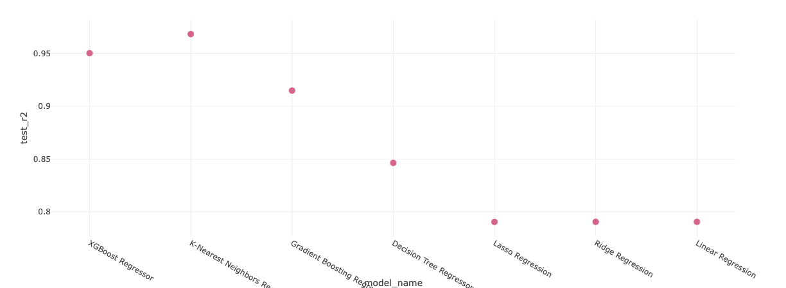
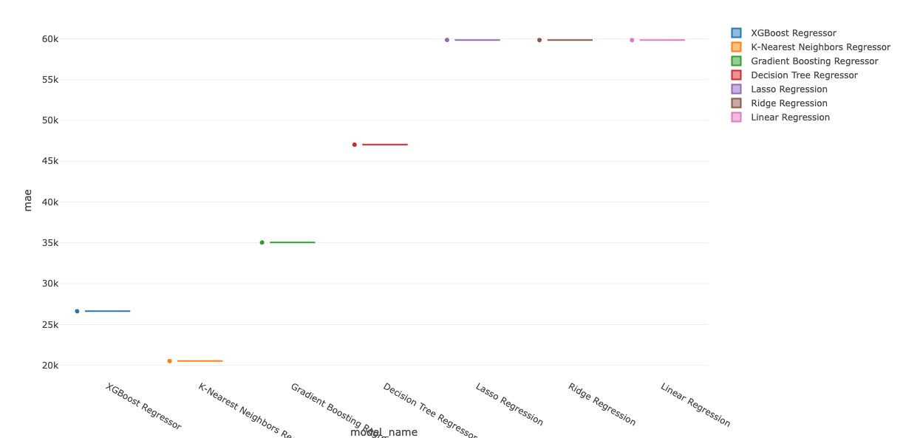

# Singapore Resale Flat Price Prediction Project

## Overview
This project predicts the resale prices of Singapore flats using historical data and machine learning. It features a complete ML pipeline, including data ingestion, preprocessing, model training, and deployment using a **Streamlit web application**. The project incorporates **MLflow** for experiment tracking, **Docker** for containerization, and a **CI/CD pipeline** for automated deployment.

---

## Project Architecture

### 1. Data Ingestion
- Collects historical flat resale data from an API.
- Saves the raw data in a structured format for further preprocessing.

### 2. Data Transformation
- Handles preprocessing, including missing value imputation, encoding, and scaling.
- Converts raw data into a format suitable for ML models.

### 3. Model Training
- Trains multiple regression algorithms:
  - **Linear Regression**
  - **Lasso Regression**
  - **Ridge Regression**
  - **Decision Tree**
  - **KNN Regressor**
  - **Gradient Boosting**
  - **XGBoost**

- Uses `GridSearchCV` for hyperparameter tuning to optimize model performance.
- Tracks performance metrics (R², MAE, MSE) using **MLflow**.
- Registers the best-performing model for deployment.

### 4. Web Application
- Built using **Streamlit** for user-friendly interaction.
- Accepts user inputs (e.g., town, flat type, floor area) and predicts resale prices dynamically.

**Screenshot of the Web Application:**


**Or a GIF of the Web Application in Action:**


### 5. Utilities
- Provides reusable functions for:
  - Saving/loading ML models.
  - Fetching data from APIs.
  - Automating repetitive tasks.

---

## Deployment Details

### Best Model
After hyperparameter tuning, **KNN Regressor** was selected as the best model with the following parameters:
- **Number of Neighbors (n_neighbors)**: 3

#### Performance Metrics:
- **R² Score**: 0.97
- **Mean Absolute Error (MAE)**: $20,527.59
- **Mean Squared Error (MSE)**: $969,087,685.32

### Model Performance Comparison

#### R&sup2; Score Chart


#### MAE Chart


### MLflow Integration
- **Experiment Tracking**: Logs hyperparameters, metrics, and models during training for reproducibility.
- **Model Registry**: Stores and manages the best-performing model for deployment.
- **Comparison**: Enables evaluation of multiple models to select the best one.

---

### CI/CD Pipeline

#### Automation
1. **Code Testing**: Validates the pipeline for errors.
2. **Docker Build**: Automates container creation for deployment.
3. **Deployment**: Pushes Docker images to a cloud platform.

#### Tools Used
- **GitHub Actions**: Automates CI/CD workflow.
- **AWS EC2**: Hosts the web application.
- **Docker Hub**: Stores container images for deployment.

### Docker Deployment
- **Dockerfile**:
  - Uses Python as the base image.
  - Installs dependencies from `requirements.txt`.
  - Exposes the Streamlit app on a specified port.
  - Launches the app upon container startup.
  
---

## Workflow Summary

1. **Development**:
   - Create ingestion, transformation, and training pipelines.
   - Use **MLflow** to track experiments and log models.

2. **Testing and Validation**:
   - Run the pipeline via `main.py` to verify functionality.
   - Evaluate performance and choose the best model.

3. **Deployment**:
   - Containerize the application using Docker.
   - Automate testing and deployment with a CI/CD pipeline.

4. **Monitoring and Retraining**:
   - Track model performance via **MLflow** and the Streamlit app.
   - Incorporate new data for retraining and updating the model.

---

## Running the Project

### Local Setup
1. Clone the repository:
   ```bash
   git clone <repo_url>
   cd singapore-resale-flat-prediction
2. Install dependencies:
   ```bash
   pip install -r requirements.txt
3. Run the Application:
   ```bash
   pip install -r requirements.txt

### Docker Setup

1. **Build the Docker image**:
   ```bash
   docker build -t singapore-resale-flat-prediction .
2. **Run the container**:
   ```bash
   docker run -p 8501:8501 singapore-resale-flat-prediction
### Features

1. **End-to-End ML Pipeline**:  
   Automates data ingestion, transformation, model training, and prediction to streamline the machine learning workflow.

2. **User-Friendly Web Application**:  
   A Streamlit interface provides an intuitive and simple way for users to interact with the model and view predictions.

3. **Experiment Tracking**:  
   MLflow ensures reproducibility of experiments and efficient model management, tracking parameters, metrics, and models.

4. **Scalable Deployment**:  
   Docker and CI/CD pipelines create a reliable and maintainable solution, ensuring smooth scalability and easy updates.

---

### Summary

This setup is:
- **Production-Ready**: Ensures reliability and performance for real-world use.
- **Scalable**: Easily handles updates and growth in demand.
- **Flexible**: Adapts to changes in data trends and requirements.

The system provides a robust solution for predicting Singapore flat resale prices, combining advanced machine learning techniques with modern software engineering practices.

